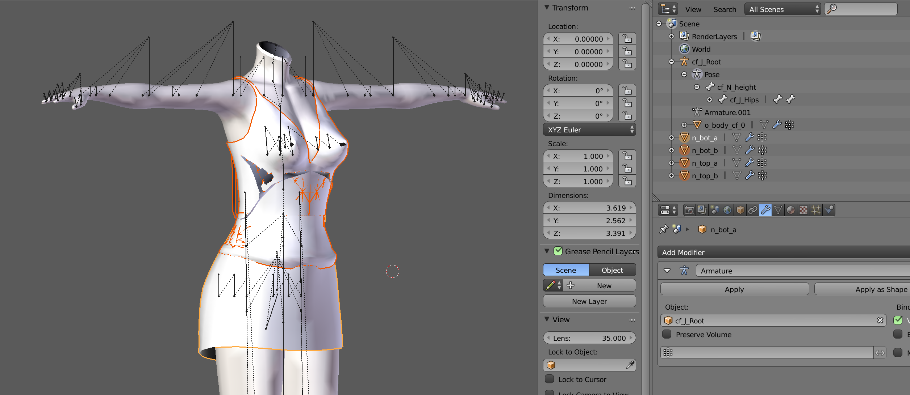
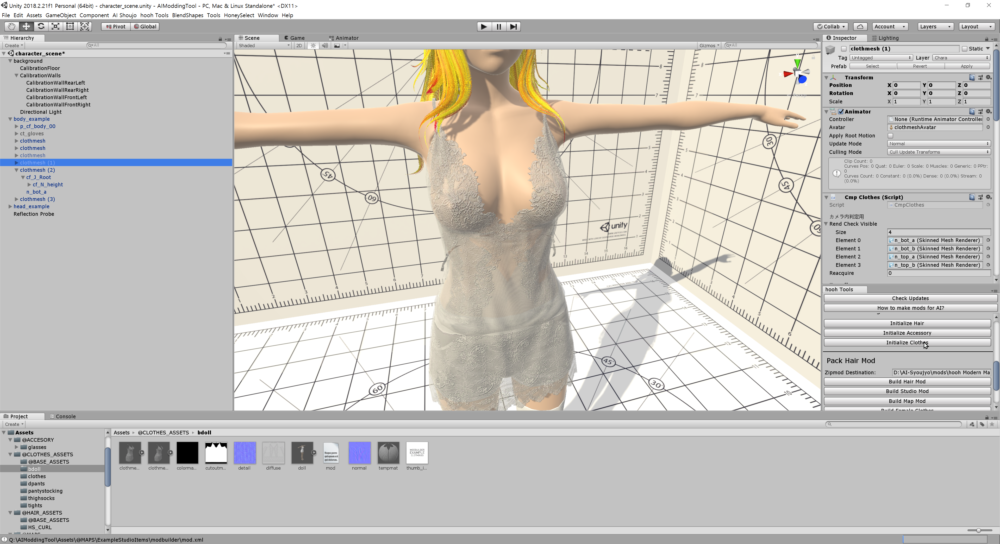

# How to make Top Clothes

## Related Document

This page only contains how to put hair models into the game with adjustable attributes.

If you need more basic information like setup folders or preparing hair assets, please visit the pages below before continuing to read this document:

-   [Getting Started with the hooh's Modding Tool](getting_started.md)

-   [Setting up Folder](tutorials/gearing-up.md)

### Prepare Mesh

Your mesh should meet following condition to be used for the game. (or you can use .blend file as template.)

1. the root should be cf_J_Root
2. cf_J_Root and cf_N_Height should be 0, 0, 0 Angle.
3. you need to export fbx as "clothmesh.fbx" (hooh Modding tool automatically converts mesh into AI-Compatible Mode)
4. you need to export "FBX ALL" Scale
5. the file should have one or two pairs of state meshes (the name can't be changed or you have to manually assign meshes.)
    - Pair Bottom
        - n_bot_a : Clothing Bottom - Clothed state
        - n_bot_b : Clothing Bottom - Half state
    - Pair Top
        - n_top_a : Clothing Top - Clothed state
        - n_top_b : Clothing Top - Half State
6. The fbx should only have mesh and bones but nothing else. (as you can see, I only exported selected objects. bones and clothing meshes.)

### Setup GameObject

Open `character_scene.unity` in Modding Tool (it's opened by default.)

Drag your clothemesh.fbx to body_example and see if the mesh fits.

After that, hit Initialize Clothes.

### Adjust Textures

#### ColorMask

Colormask currently works like this:

|       | Color         | Name         | Description                              |
| ----- | ------------- | ------------ | ---------------------------------------- |
| BLACK | (0, 0, 0)     | Color 1      | Where Color 1 Applied                    |
| RED   | (255, 0, 0)   | Color 2      | Where Color 2 Applied                    |
| GREEN | (0, 255, 0)   | Color 3      | Where Color 3 Applied                    |
| BLUE  | (0, 0, 255)   | Color 4      | Where Color 4 Applied                    |
| A     | (X, X,X, 255) | Pattern Mask | Where UV Pattern will appear on texture. |

### Register Prefab

Drag your gameobject to Project folder.

### Make mod.xml

Make your own mod.xml. Here is [example](https://github.com/hooh-hooah/ModdingTool/blob/master/Assets/%40CLOTHES_ASSETS/bdoll/mod.xml)

### Build Mod

Specify Zipmod Destination and click build Female Clothes.

Remember, you need to install [Bandizip](https://kr.bandisoft.com/bandizip/) in C: Drive at this moment to pack zipmods. I will change this later.

### Test In-Game

Test your clothes working in-game.

### Trouble Shooting

#### I can't build my mod!

Check [here](https://github.com/hooh-hooah/ModdingTool#trouble-shooting)

#### I can see my mod but it won't load when I click it

This is mostly caused wrong setup of your game object.

1. The clothes does not have CmpComponents.

    You can initialize most of things by clicking Initialize xxxx

2. You forgot something

    Do your clothes scaled properly? Everything should be 1.

    Do your gameobject has mesh renderers?
